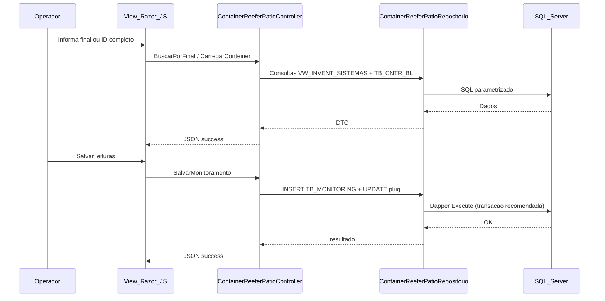

# Desenho da solucao MVC (sem implementacao) — Container REEFER (Patio)

## Alinhamento ao projeto Romaneio (evidencia)

Padroes observados em telas de patio existentes (ex.: `MovimentacaoContainerPatioController`):

- Controller herda `DefaultController` (nao `BaseController` diretamente).
- Injecao via **Unity** em `Global.asax.cs` (`RegisterType<I..., ...Repositorio>`).
- **Session**: `Session["Logado"]`, `Session["Patio"]`, `Session["UsuarioId"]` para contexto operador.
- **Dapper** + `SqlConnection` encapsulado em repositorio (`Open()`, timeouts via `Config.QueryTimeoutInSeconds()`).
- Helper **`MontarFiltroPatio`** (em `Romaneio.Helpers` / repositorio) ja trata **unificacao de patios 1 e 7** — **reutilizar** na migracao para espelhar `ReeferS` sem duplicar logica ad hoc.
- Views com `@model` + script JS com URLs geradas por `Url.Action`.
- Entrada no menu em `Views/Home/Home.cshtml` com `location.href` para `~/.../Index`.

## Proposta de composicao (artefatos novos minimos)

| Camada | Artefato sugerido |
|--------|-------------------|
| Controller | `ContainerReeferPatioController` |
| ViewModel | `ContainerReeferPatioViewModel` + DTOs de linha de grid (`ContainerReeferHistoricoLinhaDto`, `ContainerReeferListaLinhaDto`, etc.) |
| Repositorio | `IContainerReeferPatioRepositorio` + `ContainerReeferPatioRepositorio` |
| View | `Views/ContainerReeferPatio/Index.cshtml` |
| JavaScript | `Content/js/container-reefer-patio.js` (ou bloco script na view seguindo padrao da tela mais proxima) |
| DI | Registro em `Global.asax.cs` |
| Menu | Link em `Home.cshtml` (texto alinhado ao legado: "Conteiner - REEFER" / descricao de patio) |

**Hipotese de nome**: ajustar nome do controller/rota para convencao de negocio aprovada pelo time (ex.: `ReeferMonitoramentoPatio`).

## Rotas e endpoints (proposta)

Rota MVC padrao: `~/ContainerReeferPatio/Index`.

| Metodo | Acao | Contrato (proposta) |
|--------|------|---------------------|
| GET | `Index` | Retorna view com `PATIO`, `DESCR_PATIO`, flags de permissao se necessario |
| POST | `BuscarPorFinal` | body: `{ final: string }` — replica `Busca_Cntr` |
| POST | `CarregarConteiner` | body: `{ idConteiner: string }` — replica `Busca_Dados` + metadados MIN/MAX/plug |
| POST | `ListarHistorico` | body: `{ sistema: string, autonumIpa: long?, autonumRdx: long?, autonumOp: long? }` — replica `Carrega_Grid1` |
| POST | `SalvarMonitoramento` | body: DTO com medidas + ids sistema — replica `Command1_Click` (INSERT + UPDATEs) |
| POST | `RegistrarPlugOff` | body: `{ autonumIpa: long }` — replica `Command2_Click` com mesmas guardas |
| POST | `ListarEntradasPrevistas` | sem body ou patio implicito da sessao |
| POST | `ListarEstoqueReefer` | body: `{ apenasDesligados: bool, comAgendamentoSaida: bool, posicionados: bool }` |
| POST | `ListarUnidadesDesligadas` | sem body adicional |

Todas as acoes POST retornam `JsonResult` no padrao `{ success, message, data }` como outras telas.

## Fluxo front-end / back-end

## Servico / caso de uso

Opcional: camada fina `IContainerReeferPatioService` **somente** se surgire logica compartilhada com outro modulo.

Recomendacao inicial: **manter logica no repositorio** seguindo padrao de `MovimentacaoContainerPatioRepositorio` (metodos longos com SQL centralizado), extraindo para service **se** o metodo crescer demais.

## Adaptacoes do comportamento VB6 para web

1. **Remover `SendKeys`**: tab order HTML + handler de Enter opcional.
2. **Confirmacao explicita** para PLUG OFF e para divergencia de temperatura (modal Bootstrap).
3. **Parametrizar SQL** (`DynamicParameters`) — eliminar concatenacao do legado.
4. **Transacao** no `SalvarMonitoramento`: agrupar INSERT + UPDATE(s) de limpeza de plug.
5. **Correcao funcional deliberada**: no ramo de ventilacao vazio, preencher **ventilacao setpoint** (nao umidade) — documentar como correcao de bug do legado com aprovacao de negocio.
6. **Unificar patio 1/7**: delegar a `MontarFiltroPatio` para manter uma unica implementacao com outras telas.

## Permissoes

- **Hipotese**: validar se existe funcao de menu similar a `Valida_Acesso_Botao` do coletor arm (`mdlColetor.bas`) para Patio — no `PrincipalS.frm` analisado nao foi lido o trecho de `Form_Activate`; pode haver controle de visibilidade de botao.

## Testes automatizados (futuro)

- Testes de integracao em SQL com transacao rollback para INSERT/UPDATE.
- Testes unitarios de montagem de filtro patio (1/7) reutilizando helper.

## Checklist interno (Agente 05)

- [x] Padroes Romaneio referenciados
- [x] Artefatos minimos definidos
- [x] Reuso de helper de patio avaliado (`MontarFiltroPatio`)
- [x] Rotas e payloads definidos
- [x] Atalhos / teclado adaptados
- [x] Compatibilidade com legado explicitada (correcao de bug opcional)
