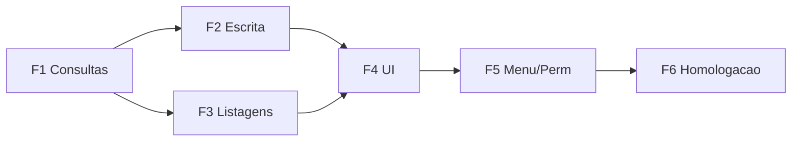

# Plano de implementacao — Container REEFER (Patio)

## Premissas

- Escopo **somente** equivalente a `ReeferS.frm` + integracoes de banco evidenciadas (nao inclui `Reefer.frm` salvo flag de build/config explicita).
- Banco alvo: **SQL Server** (queries atuais usam `CONVERT`, `ISNULL`, `GETDATE()`).
- Conexao e credenciais ja configuradas como demais repositorios Romaneio.

## Fases sugeridas

### Fase 1 — Contratos e persistencia base

- Criar `IContainerReeferPatioRepositorio` com assinaturas dos metodos mapeados no desenho MVC.
- Implementar consultas **somente leitura**:
  - Busca por final (COUNT + SELECT id)
  - Carregar conteiner (`VW_INVENT_SISTEMAS` + `TB_CNTR_BL` para plug e min/max)
  - Historico `TB_MONITORING`
- **Criterio de pronto**: endpoints retornam dados identicos ao legado para conjunto de fixtures SQL (contener IPA, RDX, OP).

### Fase 2 — Operacoes de escrita

- Implementar `SalvarMonitoramento` com **transacao** (INSERT + UPDATE NULL plug).
- Implementar `RegistrarPlugOff` com mesmas condicoes de UI traduzidas para validacao server-side.
- **Criterio de pronto**: mesma sequencia de estados de `DT_PLUG_OFF` observada no VB6 para casos cobertos (IPA; RDX no salvar apenas ReeferS).

### Fase 3 — Abas de listagem

- Portar SQLs de entradas previstas, estoque e desligados com filtros.
- Reproduzir highlight de linhas com plug off (informacao devolvida ao front como flag booleana por linha em vez de cor de grid VB).

### Fase 4 — Controller + View + JS

- `Index` com modelo enxuto (patio, descricao).
- JS: fluxo de busca, validacao client-side espelhando `Valida_Dados` (nao substituir validacao server-side).
- Mascaras de input alinhadas ao legado.

### Fase 5 — Integracao de menu e permissoes

- Link no `Home.cshtml`.
- Pesquisar no Romaneio se ja existe verificacao de permissao por codigo de funcao para modulo patio; alinhar.

### Fase 6 — Homologacao

- Roteiro de testes com casos: final inexistente, multiplos finais, DRY, reefer desligado, divergencia temperatura, plug off bloqueado, salvar limpando plug, patios 1 e 7.

## Dependencias entre fases

## Checklist tecnico final (executavel)

- [ ] SQL parametrizado em todos os metodos
- [ ] Transacao em salvar monitoramento
- [ ] Timeout e tratamento de erro padrao Romaneio
- [ ] Sessao validada em cada POST
- [ ] Reuso de `MontarFiltroPatio` para filtro 1/7
- [ ] Confirmacao modal PLUG OFF
- [ ] Confirmacao divergencia temperatura
- [ ] Teste manual documentado anexado ao card/issue

## Riscos por fase

| Fase | Risco | Mitigacao |
|------|-------|-----------|
| F1 | View `VW_INVENT_SISTEMAS` depende de `Banco_Operador` dinamico | Centralizar prefixo de schema como outros repos |
| F2 | Divergencia entre correcao de bug ventilacao vs fidelidade 100% | Flag de configuracao ou decisao formal |
| F3 | SQL com `CASE WHEN NULL` retorna dados inesperados | Validar com DBA / comparar resultado com VB6 |
| F4 | Operador espera atalhos identicos | Documentar novos atalhos ou suportar teclado |

## Checklist interno (Agente 06)

- [x] Etapas pequenas definidas
- [x] Dependencias explicitadas
- [x] Criterios de pronto por etapa
- [x] Plano de testes
- [x] Riscos por etapa
