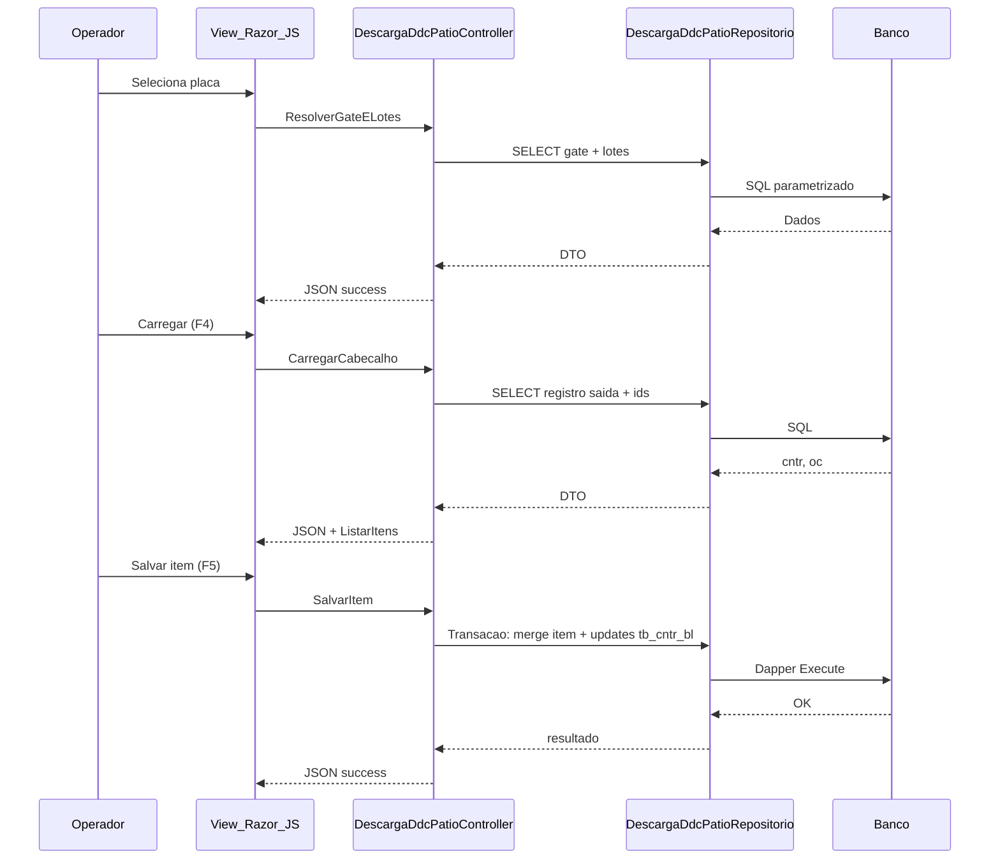

# Desenho da solucao MVC (sem implementacao) — Descarga DDC (Patio)

## Alinhamento ao projeto Romaneio (evidencia)

Padroes observados em telas recentes de patio (ex.: `ContainerReeferPatioController`):

- Controller pode herdar `DefaultController` e usar `Session["Logado"]`, `Session["Patio"]`, `Session["UsuarioId"]`.
- Injecao via **Unity** em `Global.asax.cs` (`RegisterType<I..., ...Repositorio>`).
- Consultas e gravacoes encapsuladas em **repositorio** com **Dapper** + `SqlConnection` (`Config.StringConexao()`).
- Respostas JSON `{ success, message, data }` em acoes POST.
- Scripts em `Content/js/*.js` e views em `Views/<Controller>/Index.cshtml`.

**Nota de plataforma**: o legado VB6 mistura sintaxe **Oracle** (`dual`, `nvl`, `seq`, `sysdate`) e trechos com **`isnull`**; o Romaneio atual aponta para **SQL Server** (`SqlConnection`). O desenho abaixo assume **adaptacao de SQL** para o dialeto real do ambiente Romaneio (parametrizado), mantendo as **mesmas tabelas/colunas semanticas**.

## Proposta de composicao (artefatos novos minimos)

| Camada | Artefato sugerido |
|--------|-------------------|
| Controller | `DescargaDdcPatioController` (nome ajustavel ao padrao de rotas do time) |
| ViewModel | `DescargaDdcPatioViewModel` + DTOs (`PlacaDdcListItemDto`, `LoteAtivoDto`, `DescargaArmazemItemDto`, `EmbalagemDto`) |
| Repositorio | `IDescargaDdcPatioRepositorio` + `DescargaDdcPatioRepositorio` |
| View | `Views/DescargaDdcPatio/Index.cshtml` |
| JavaScript | `Content/js/descarga-ddc-patio.js` |
| DI | Registro em `Global.asax.cs` |
| Menu | Link em `Views/Home/Home.cshtml` (texto alinhado ao legado: "Descarga DDC") |

**Hipotese de nome**: validar com negocio se a rota publica deve mencionar "Armazem" (caption legado) ou "DDC Patio" (menu).

## Rotas e endpoints (proposta)

Rota MVC padrao: `~/DescargaDdcPatio/Index`.

| Metodo | Acao | Contrato (proposta) |
|--------|------|---------------------|
| GET | `Index` | View com modelo basico (titulos, patio da sessao se necessario) |
| POST | `ListarPlacasDdc` | sem body ou com filtro textual — replica `Carrega_Placa` |
| POST | `ResolverGateELotes` | body: `{ autonumRegistroSaida: long }` — replica `cbPlaca_LostFocus` (gate + lotes) |
| POST | `CarregarCabecalho` | body: `{ autonumRegistroSaida: long, autonumLote: long }` — replica `CARREGAR` |
| GET/POST | `ListarItens` | body/query: `{ cntr: long, gate: long }` — replica `Carrega_Grid1` |
| GET | `ListarEmbalagens` | replica `Form_Load` de embalagens |
| POST | `SalvarItem` | body: `{ cntr, gate, lote, ordemCarreg, quantidade, embalagem, finalizado, autonumItem? }` |
| POST | `ExcluirItem` | body: `{ autonumItem: long }` |
| POST | `LimparSessaoTela` | opcional — estado client-side pode bastar |

## Fluxo front-end / back-end

## Servico / caso de uso

Recomendacao: comecar **sem** service dedicado; se a transacao `SalvarItem` crescer, extrair `IDescargaDdcPatioService` para testes unitarios.

## Adaptacoes do comportamento VB6 para web

| Legado | Web |
|--------|-----|
| `MsgBox` | JSON `message` + modal/toast na view |
| `ADODC`/`DataCombo`/`DataGrid` | Fetch JSON + componentes HTML |
| SQL concatenado | Parametros + validacao de tipos |
| Multiplos `Executa` sem transacao | **Transacao unica** no `SalvarItem` (recomendado) |
| Atalhos F2-F6 | Botoes + shortcuts opcionais sem conflitar com browser |

## Seguranca

- Revalidar no servidor: pertencimento do `cntr/gate` ao patio/sessao (**Hipotese**: regra de patio pode exigir join adicional nao presente no legado).
- Autorizacao: reutilizar padrao de `Session` / permissoes se existir modulo equivalente ao `Valida_Acesso_Botao` do `mdlColetor.bas`.
