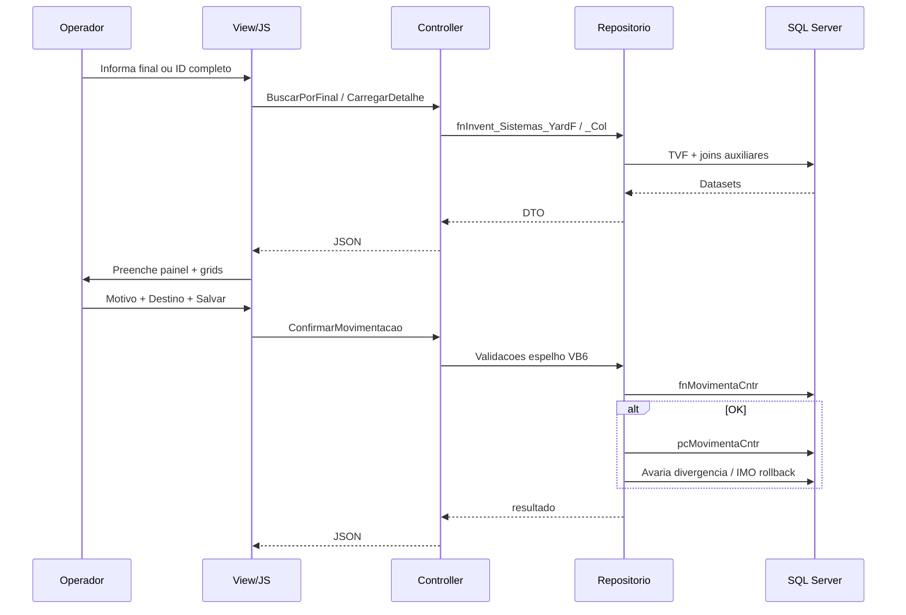

# 05 — Desenho da solução MVC (Romaneio) — Movimentação Container: Pátio

**Escopo:** proposta alinhada ao padrão já usado em telas como `LocalizacaoCarregamentosController` + repositório dedicado + JSON para grids/ações. **Sem implementação neste artefato.**

---

## Padrões existentes a reutilizar

- Sessão: `Session["Logado"]`, `Session["Patio"]`, `Session["UsuarioId"]` (como `LocalizacaoCarregamentosController` e `MovimentacaoCSController`).
- Herança: `DefaultController` para mensagens comuns de contêiner (`noCntr`, `moreCntr` — reuso conceitual das mensagens de ambiguidade).
- Persistência: Dapper + `SqlConnection` em repositórios (`LocalizacaoCarregamentosRepositorio` como referência de **transação**, **filtro de pátio** e **JSON**).
- Front: Views Razor + scripts por feature (`Content/js/...`) e componentes Bootstrap/Select2 já presentes.

---

## Arquitetura sugerida (arquivos)

| Camada | Artefato sugerido |
|--------|-------------------|
| Controller | `MovimentacaoContainerPatioController.cs` (ou nome curto `MovimentacaoCntrPatioController` — escolher uma convenção e manter) |
| ViewModel | `MovimentacaoContainerPatioViewModel.cs` — cabeçalho (pátio, descrição) + estado da tela |
| DTOs | `CntrPatioBuscaFinalResult`, `CntrPatioDetalheDto`, `ProximoMovimentoDto`, `PilhaVizinhosDto`, `MotivoMovimentacaoDto`, `CameraDto`, `MovimentacaoCntrRequest`, `MovimentacaoCntrResponse`, `AvariaCntrListItemDto`, etc. |
| Repositório | `IMovimentacaoContainerPatioRepositorio` + `MovimentacaoContainerPatioRepositorio` |
| Views | `Views/MovimentacaoContainerPatio/Index.cshtml` (+ partials opcionais `_GridProximos.cshtml`, `_Avarias.cshtml`) |
| JavaScript | `Content/js/movimentacao-container-patio.js` |
| DI | Registrar interface em `UnityConfig.cs` (mesmo padrão dos demais repositórios) |

**Nota:** O projeto já possui `AvariasController` focado em contexto de **romaneio**. Para esta tela, preferir **serviços no mesmo repositório** ou extrair um **`IAvariasConteinerPatioRepositorio`** apenas se surgir duplicação pesada — decisão na implementação para não criar arquitetura paralela sem necessidade.

---

## Rotas e endpoints (proposta)

| Método | Rota | Função |
|--------|------|--------|
| GET | `/MovimentacaoContainerPatio` | Página principal (autenticação + VM com descriptor de pátio) |
| POST | `/MovimentacaoContainerPatio/BuscarPorFinal` | Equivalente `Busca_Cntr` |
| POST | `/MovimentacaoContainerPatio/CarregarDetalhe` | Equivalente `Busca_Dados` |
| POST | `/MovimentacaoContainerPatio/ProximosMovimentos` | `Carrega_Grid1` |
| POST | `/MovimentacaoContainerPatio/VizinhancaPilha` | `Carrega_Grid2` (payload: modo ATUAL/DESTINO, prefixo digitado) |
| POST | `/MovimentacaoContainerPatio/Motivos` | Opcional se carregar via página; pode ser estático no GET |
| POST | `/MovimentacaoContainerPatio/Cameras` | Lista por pátio / yard destino |
| POST | `/MovimentacaoContainerPatio/ConfirmarMovimentacao` | Fluxo `Atualiza_Posicao` + SP |
| GET | `/MovimentacaoContainerPatio/HistoricoShifting` | Aba histórico |
| GET | `/MovimentacaoContainerPatio/Avarias` | Lista + histórico |
| POST | `/MovimentacaoContainerPatio/Avarias/Incluir` | |
| POST | `/MovimentacaoContainerPatio/Avarias/Excluir` | |
| POST | `/MovimentacaoContainerPatio/Avarias/Finalizar` | |

Todos os POSTs retornam `JsonResult` com `{ success, message, data }` espelhando `LocalizacaoCarregamentosController`.

---

## Fluxo front-end → back-end

---

## Estratégia de Paridade com VB6

1. **Camada de repositório espelha ordem das validações** de `Atualiza_Posicao` para mensagens idênticas quando possível.
2. **Duas chamadas SQL** antes da escrita: `fnMovimentaCntr` → `pcMovimentaCntr` (parâmetros iguais aos do `Command`).
3. **Motivo com câmera:** dividir em dois requests (pré-validação abre modal; confirmação chama endpoint final) — espelha `Command1`/`Command3`.
4. **Segregação IMO:** implementar como método privado no repositório: se após `pcMovimentaCntr` a regra retornar texto, chamar **estorno** com parâmetros invertidos (ou refatorar para transação única **após** validar IMO — **melhoria técnica**, mas exige aprovação de negócio).
5. **Pátio 1/7 e pátio 3:** extrair helper `MontarFiltroPatio` (já existe lógica similar em `LocalizacaoCarregamentosRepositorio`).

---

## ViewModel (campos principais)

- `int PATIO`, `string DESCR_PATIO`
- `string FinalInformado`, `string IdConteinerCompleto`
- `string Sistema` (`I`/`A`/`R`)
- `long? AutonumCntr` (equivalente `idPatio`)
- `string YardAtual`, `string YardDestino`
- `int? MotivoId`, `int? CameraId`
- Flags de UI: `bool ExigeCamera`, `bool MostrarFrameTransporteInterno`, badges Reefer/DTA/desova
- Filhos: listas de DTOs para grids e BLs

---

## JavaScript

- Módulo único com: máscaras, uppercase em destino, chamadas AJAX, bloqueio de double-submit no **Salvar**.
- Para Enter→Tab: opcional; preferir navegação padrão do browser exceto no campo “final”.
- Mensagens: `toastr` ou padrão já usado na feature irmã (ver `consulta-lib-carregamento.js` / localização).

---

## Segurança e auditoria

- Repetir checagem `Session["Logado"]` em cada action.
- Parametrizar **todos** os SQL migrados (eliminar concatenação na nova implementação).
- Logar usuário, autonum, origem/destino, motivo em tabela de auditoria **somente se** o produto já tiver padrão — **hipótese**: pode não existir; não inventar sem requisito.

---

## O que **não** duplicar

- Evitar nova camada “UseCase” separada se o projeto mantém lógica nos repositórios — somente introduzir serviço se métodos do repositório ultrapassarem ~300–400 linhas ou se testes unitários exigirem.

---

## Decisões em aberto (para implementação)

1. Unificar **finalização de avarias** com fluxo de `AvariasController` ou manter isolado por contêiner/pátio.
2. Tratamento do SQL **Oracle** legado: remover, portar para SQL Server ou manter linked server.
3. Escopo do modal `FrmVeiculoServ`: incorporar como partial/modal web ou tela separada.
