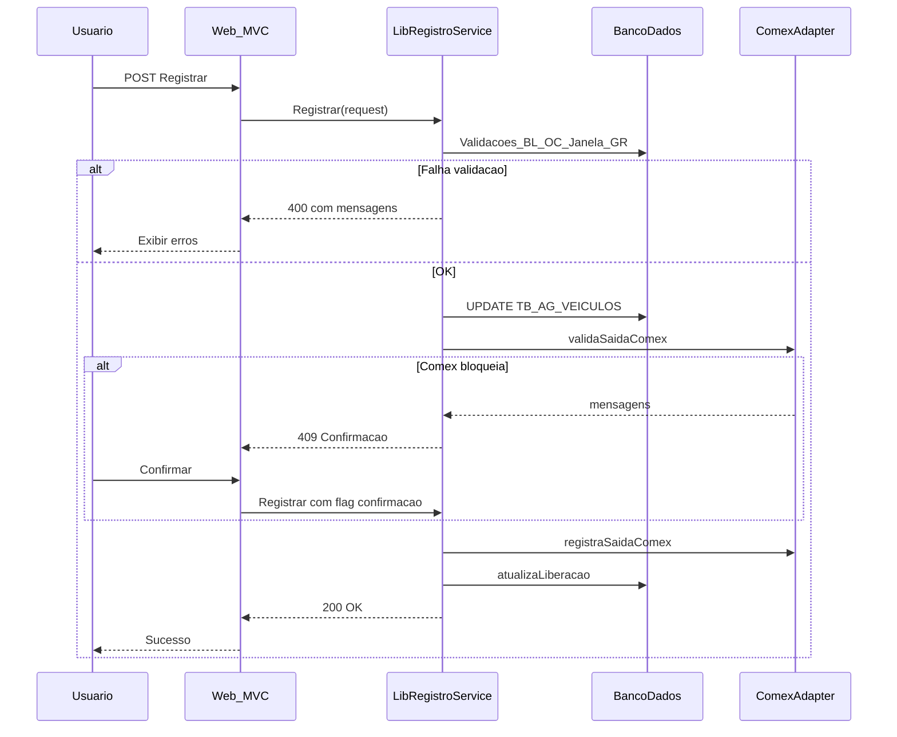

# Especificação técnica: Consulta \ Liberação de Registro → MVC C#

**Versão:** 1.1  
**Fonte legado (código):** [frmLibRegistroS.frm](../frmLibRegistroS.frm) (projeto [ColetorPatioSmall.vbp](../ColetorPatioSmall.vbp), formulário com `Attribute VB_Name = "frmLibRegistro"`).  
**Fonte de negócio / extração:** [telas_refatorar_mvc.docx](telas_refatorar_mvc.docx) — contém o mesmo núcleo de rotinas (`cmdFiltra_Click`, `Limpa`, `cmdRegistra_Click`, `Carrega_GridCS` / `Carrega_GridCNTR`, `Command1_Click`, `Form_Load`). Este markdown foi **refinado** contra esse conteúdo.  
**Abertura no menu:** [PrincipalS.frm](../PrincipalS.frm) — `Case 9` → `frmLibRegistro.Show`.

---

## 1. Objetivo e escopo

Reproduzir em aplicação web ASP.NET MVC (C#) a funcionalidade **Consulta \ Liberação de Registro** do Coletor Pátio: consultar dados de agenda / ordem de carregamento por protocolo, placa, contêiner e/ou filtro de BL; exibir status SISCARGA/SEFAZ, bloqueios, GLME e protocolos simultâneos; permitir **Registrar** liberação com validações de pátio, financeiro, janela de agendamento e integração Comex; **Limpar** formulário; abrir **Documentos** (hoje executável externo).

**Fora do escopo desta especificação:** implementação no repositório MVC alvo (não presente neste workspace).

---

## 1.1 Estado de formulário (variáveis públicas e efeitos colaterais)

Conforme `telas_refatorar_mvc.docx` / formulário VB6 — o servidor MVC deve manter equivalente **no estado da sessão ou no payload** entre “Filtrar” e “Registrar” / “Documentos”:

| Variável VB6 | Uso |
|----------------|-----|
| `autonumOC` | Ordem de carregamento (`TB_ordem_carregamento.autonum`) resolvida no filtro; chave para listas de carga, GLME, janela, Comex e `atualizaLiberacao`. |
| `Ano` | Declarado `Public` no form; **não utilizado** no trecho documentado do `cmdFiltra` / `cmdRegistra` — verificar outros eventos no `.frm` completo ou remover no redesign. |
| `AutonumCntr` | Preenchido no ramo CNTR; usado em `Command1` (documentos por contêiner). |
| `AutonumCs` | Preenchido no ramo carga solta; usado em localização e fluxo CS. |
| `autonumag` | Declarado `Public`; **não referenciado** no trecho do Word — confirmar no fonte completo. |
| `autonumlote` | `AUTONUM` do BL (`Lote`); usado em documentos (LTL vs `TB_AG_CS`). |

Após **Filtrar** com sucesso: `Command1.Enabled = True` (Documentos). **Limpar** zera contadores, esconde bloqueios, desabilita `Command1`, reinicia máscaras de protocolo/placa/CNTR.

---

## 2. Atores, permissões e contexto de sessão

| Conceito VB6 | Uso na tela |
|----------------|-------------|
| `Col_Patio` ([mdlColetor.bas](../mdlColetor.bas)) | Validação: pátio do BL do resultado deve coincidir com o pátio do usuário; exceção para pátios `1` e `7` (usuário nesses pátios aceita BL com `PATIO` 1 ou 7). |
| `Cod_Usuario` | Atualização `USUARIO_REGISTRO_CAM` em `TB_ordem_carregamento`; consulta `flag_libera_janela` em `tb_cad_usuarios`. |
| `Banco_Sgipa`, `Banco_Operador` | Prefixos de schema nas queries (ex.: `SGIPA..`, `operador..`). |
| `FLAG_CONSULTA_LIBERACAO_COLETOR` (TB_PATIOS via join) | Controla visibilidade de **Registrar** após filtro. |
| `FLAG_CONSULTA_LIBERACAO` (TB_PATIOS) | Bloqueia registro se pátio não permite consulta. |

**Permissões adicionais:** o módulo [mdlColetor.bas](../mdlColetor.bas) expõe `Valida_Acesso_Botao` para o sistema `COLETOR_ARM`. A tela do Pátio deve ser alinhada ao modelo de segurança do projeto MVC (claims/policies) equivalente ao controle de menu no `PrincipalS` / tabela de senhas do login.

---

## 3. Inventário de módulos e assinaturas inferidas (Comex / LogComex)

O [ColetorPatioSmall.vbp](../ColetorPatioSmall.vbp) referencia `Module=Registro_LogComex; ..\Registro_LogComex.bas`. **O arquivo não está presente nesta árvore de fontes.** As assinaturas abaixo foram **inferidas pelos pontos de chamada** em `frmLibRegistroS.frm` e `frmLibRegistro.frm`.

| Símbolo | Chamada observada | Parâmetros inferidos |
|---------|-------------------|----------------------|
| `validaEntregaDoc` | `validaEntregaDoc(..., 2) = 2` (segundo parâmetro fixo `2` no Coletor Pátio) | `(loteBl, modo)` → inteiro. No Word/`frmLibRegistroS` o lote aparece como `TxtLote` ou `txtLote` (VB6 **não diferencia maiúsculas** em nomes de controle). Preenche globais `msgdoc`, `msgIcms`. |
| `validaSaidaComex` | `validaSaidaComex(Nnull(txtLote.Text, 0), 2, UF) = False` | `(loteBl, modo, UF)` → `Boolean`. Usa `msgdoc`, `msgIcms`. |
| `registraSaidaComex` | `registraSaidaComex(Nnull(txtLote.Text, 0), 2, UF, Val(autonumOC), txtCpfMot.Text)` | `(loteBl, modo, UF, ordemCarregamento, cpfMotorista)` → `Boolean`. |
| `atualizaLiberacao` | `atualizaLiberacao(Val(autonumOC), Nnull(txtLote.Text, 0), IIf(mskProtocolo.ClipText = "", "", mskProtocolo.Text))` | `(autonumOC, loteBl, protocolo As String)` — protocolo vazio string quando usuário filtrou só placa/CNTR. |

**Variante Coletor Armazém** ([frmLibRegistro.frm](../frmLibRegistro.frm)): `validaSaidaComex(Nnull(txtLote.text, 0))`, `registraSaidaComex(Nnull(txtLote.text, 0), 0, txtCpfMot.text)`, `validaSaidaComexRealizada(txtLote.text)` — confirma que o porte MVC deve tratar **dois perfis de API interna** se ambos os clientes forem substituídos.

### 3.1 Funções em repositório (Microled.bas)

Implementadas em [Microled.bas](../Microled.bas) (trecho ~2909–3012):

- **`VerificaPendenteVista(BL As Long)`** — Contagem em `TB_SERVICOS_FATURADOS` + `TB_GR_PRE_CALCULO` (forma pagamento à vista); usa `NVL` (Oracle). Retorno `> 0` bloqueia fluxo. Exit antecipado se `tb_bl.flag_brascenter = 1`.
- **`VerificaFormaPagamento(BL As Long) As Integer`** — Consulta `tb_listas_precos` / `tb_bl`, condições em `TB_CAD_PARCEIROS`, depois `tb_gr_bl`. Retorno `3` isenta parte das validações de “à vista” na tela.

**Risco:** mistura de sintaxe SQL Server (`ISNULL`, `CONVERT`) em `frmLibRegistroS` e Oracle (`NVL`, `nvl`) em `Microled` / `VerificaPendenteVista`. O serviço C# deve usar **dois providers ou camada DAL** explícita por banco.

---

## 4. Mapeamento UI VB6 → ViewModel / DTO (MVC)

### 4.1 Campos de entrada (filtro)

| Controle VB6 | Máscara / formato | Proposta web |
|----------------|-------------------|--------------|
| `mskProtocolo` | `######/####` | `Protocolo` string normalizada `NNNNNN/AAAA` ou 10 dígitos internos; validação server-side. |
| `mskPlaca` | `>???-#A##` (Mercosul legado VB) | `PlacaCavalo` — validação placa BR; armazenar sem máscara para query. |
| `CNTR` | `######-#` | `ConteinerParcial` — alinhar com `SUBSTRING(ID_CONTEINER,5,8)` no SQL legado. |
| `TxtFiltroBL` | texto livre | `FiltroNumeroBl` — correspondente a `bl.numero LIKE '%...%'` (parametrizar `%` para evitar injeção). |

### 4.2 Campos somente leitura (resultado do filtro)

| Controle VB6 | Significado |
|----------------|-------------|
| `txtPeriodo` | Período de agendamento (texto formatado). |
| `TxtLote` | `AUTONUM` do BL (lote). |
| `txtBL` | Número do documento / BL exibido (`NUM_DOCUMENTO`). |
| `txtTransp`, `txtMot`, `txtCpfMot` | Transportadora, motorista, CPF (CPF hidden no designer mas preenchido). |
| `txtPlacas` | Cavalo + carreta (no Pátio: duas linhas `vbCrLf`); **no MVC usar `PlacaCavalo` e `PlacaCarreta` separados** — o UPDATE em `TB_AG_VEICULOS` usa `Left(txtPlacas,8)` e `Right(txtPlacas,8)`, o que é frágil com quebra de linha. |
| `txtLocal` | Localização de armazém (`vw_invent_armazem_item`). |
| `txtSiscarga`, `txtSefaz` | Mensagens SISCARGA / SEFAZ ou `LIBERADO` / `NÃO ANALISADO`. |
| `listaCarga` | Lista de linhas de carga (CS ou CNTR). |
| `lstSimultaneos` | Outros protocolos mesma placa cavalo e período. |
| `cbTipoVeiculo` | Combo `TB_TIPOS_CAMINHAO` (`AUTONUM`, `DESCR`). |

### 4.3 Flags de UI

| Label / estado | Regra resumida |
|-----------------|----------------|
| `lblbloqueioBL` | `max(flag_bloqueio + flag_bloqueio_manual)` em `tb_bl` > 0. |
| `lblbloqueioCntr` | Ramo CNTR: `flag_bloqueio = 1` no registro de `tb_cntr_bl`. |
| `lblGLME` | Contagem GLME em `TB_registro_saida_cs` / `TB_registro_saida_cntr` vs `TB_etapas_carga`; mensagem rodapé GLME no legado. |
| `cmdRegistra` | Visível se `FLAG_CONSULTA_LIBERACAO_COLETOR > 0`; desabilitado se OC não encontrada, etc. |
| `Command1` (Documentos) | Habilitado após filtro bem-sucedido com `AutonumCntr` ou `AutonumCs` / lote. |

### 4.4 Contrato C# sugerido (resumo)

```csharp
public sealed class LibRegistroFiltroRequest
{
    public string? Protocolo { get; init; }
    public string? PlacaCavalo { get; init; }
    public string? ConteinerIdParcial { get; init; }
    public string? FiltroNumeroBl { get; init; }
}

public sealed class LibRegistroConsultaResponse
{
    public LibRegistroFiltroRequest? EcoFiltro { get; init; }
    public string? ProtocoloNormalizado { get; init; }
    public long? AutonumOrdemCarregamento { get; init; }
    public long AutonumLote { get; init; }
    public long? AutonumCntr { get; init; }
    public long? AutonumCs { get; init; }
    public int PatioBl { get; init; }
    public string Periodo { get; init; } = "";
    public string NumDocumento { get; init; } = "";
    public string Transportadora { get; init; } = "";
    public string Motorista { get; init; } = "";
    public string CpfMotorista { get; init; } = "";
    public string PlacaCavalo { get; init; } = "";
    public string PlacaCarreta { get; init; } = "";
    public string LocalizacaoCarga { get; init; } = "";
    public string StatusSiscarga { get; init; } = "";
    public string StatusSefaz { get; init; } = "";
    public IReadOnlyList<string> LinhasCarga { get; init; } = Array.Empty<string>();
    public IReadOnlyList<string> ProtocolosSimultaneos { get; init; } = Array.Empty<string>();
    public IReadOnlyList<TipoVeiculoItem> TiposVeiculo { get; init; } = Array.Empty<TipoVeiculoItem>();
    public int? TipoVeiculoSelecionadoId { get; init; }
    public bool BloqueioBl { get; init; }
    public bool BloqueioCntr { get; init; }
    public bool AlertaGlme { get; init; }
    public bool PodeExibirRegistrar { get; init; }
    public bool PodeAbrirDocumentos { get; init; }
}

public sealed class TipoVeiculoItem
{
    public int Autonum { get; init; }
    public string Descricao { get; init; } = "";
}

public sealed class LibRegistroRegistrarRequest
{
    public long AutonumOrdemCarregamento { get; init; }
    public long AutonumLote { get; init; }
    public string? Protocolo { get; init; }
    public int TipoVeiculoId { get; init; }
    public string PlacaCavalo { get; init; } = "";
    public string PlacaCarreta { get; init; } = "";
    public string CpfMotorista { get; init; } = "";
    public bool UsuarioConfirmouForaJanela { get; init; }
    public bool UsuarioConfirmouComexPendente { get; init; }
}
```

---

## 5. Matriz de consultas SQL (frmLibRegistroS)

Prefixo `Banco_Sgipa` / `Banco_Operador` como no legado. **Todos os literais dinâmicos devem virar parâmetros** no MVC.

| ID | Gatilho | Parâmetros principais | Tabelas / views | Finalidade |
|----|---------|----------------------|-----------------|------------|
| Q1 | Filtrar — ramo agenda CS | `prot`, placa, `TxtFiltroBL` | `VW_AGENDA_CS`, `TB_BL`, `TB_PATIOS`, `tb_cad_transportadoras` | Cabeçalho carga solta + flags pátio + tipo caminhão. |
| Q2 | Filtrar — UNION se protocolo vazio | placa, `TxtFiltroBL` | `tb_ordem_carregamento`, `tb_registro_saida_cs`, `tb_carga_solta`, `TB_BL`, `VW_AGENDA_CS` (left), motoristas, transportadoras | Mesmo shape do SELECT principal sem protocolo digitado. |
| Q3 | Resolver OC por protocolo | Valor do **controle** `mskProtocolo` (string da máscara), não a variável `prot` — ver §6.1 | `tb_ordem_carregamento` (`protocolo=`) | `autonum` ordem (SQL2). |
| Q4 | Resolver OC alternativa | `AUTONUM_CS`, opcional placa | `tb_registro_saida_cs`, `tb_ordem_carregamento` | `min(ordem_carreg)` com `data_ordem is null`. |
| Q5 | Bloqueio BL | `TxtLote` | `tb_bl` | `lblbloqueioBL`. |
| Q6 | Filtrar — ramo CNTR | protocolo ou placa+substring CNTR, BL | `tb_cntr_bl`, `TB_AMR_CNTR_BL`, `TB_BL`, `TB_GD_RESERVA`, `TB_registro_saida_cntr`, `TB_ordem_carregamento`, `tb_motoristas`, `tb_cad_transportadoras`, `TB_PATIOS`, `tb_ag_veiculos` | Cabeçalho contêiner + `ordem` + `flag_bloqueio`. |
| Q7 | Protocolos simultâneos | `Me.mskProtocolo.Text` (máscara) | `VW_AGENDA_CS` self-join | Lista `lstSimultaneos`; alinhar com protocolo canônico (§6.1). |
| Q8 | Indicador GLME (pós-filtro) | `autonumOC` | `TB_registro_saida_cs`, `tb_carga_solta`, `TB_etapas_carga` | Visibilidade `lblGLME`. |
| Q9 | Localização | `AUTONUM_CS` | `vw_invent_armazem_item` | `txtLocal`. |
| Q10 | Lista carga CS | `autonumOC` | `TB_REGISTRO_SAIDA_CS`, `TB_CARGA_SOLTA`, `DTE_TB_EMBALAGENS` | Itens `listaCarga`. |
| Q11 | Lista carga CNTR | `ordem` | `TB_CNTR_BL`, `tb_registro_saida_cntr` | Itens `listaCarga`. |
| Q12 | Tipos veículo | — | `TB_TIPOS_CAMINHAO` | Combo (`Form_Load`). |
| Q13 | Registrar — OC | `autonumOC` | `tb_ordem_carregamento` | UF, `data_ordem` já preenchida (short-circuit). |
| Q14 | Free time / GR | `TxtLote` | `TB_GR_BL` | Bloqueio se sem data ou data registro > free time (`NVL` na query legada). |
| Q15 | Flag consulta liberação pátio | `TxtLote` | `TB_BL`, `TB_PATIOS` | Msg “Pátio parametrizado…”. |
| Q16 | Update tipo caminhão | tipo id, placas | `TB_AG_VEICULOS` | Antes Comex. |
| Q17 | Janela — reserva CNTR | `autonumOC` | `TB_registro_saida_cntr`, `tb_cntr_bl`, `tb_gd_reserva` | Período + janela horas. |
| Q18 | Janela — reserva CS | `autonumOC` | `TB_ordem_carregamento`, `tb_ag_cs`, `tb_gd_reserva` | Fallback se Q17 vazio. |
| Q19 | Update OC após janela | usuário, gd reserva | `TB_ordem_carregamento` | `USUARIO_REGISTRO_CAM`, `AUTONUM_GD_PERIODO`. |
| Q20 | Permissão libera janela | `Cod_Usuario` | `tb_cad_usuarios` | Fora do período. |
| Q21 | Flag fora período | `autonumOC` | `TB_ordem_carregamento` | `FLAG_FORA_PERIODO=1`. |
| Q22 | Libera Sefaz / tipo doc | `TxtLote` | `tb_bl` | `flag_libera_sefaz`, `Tipo_Documento` (DTA = 8). |
| Q23 | LTL | `TxtLote` | `tb_bl` | Mensagem pós-`atualizaLiberacao`. |
| Q24 | GLME no Registrar | `autonumOC` | `TB_registro_saida_cs`, `TB_registro_saida_cntr`, `TB_etapas_carga`, `tb_amr_cntr_bl` | Bloqueio “Carga sem Liberação GLME”. |
| Q25 | Documentos — CNTR | `AutonumCntr` | `TB_CNTR_BL` | Validar existência antes do Shell. |
| Q26 | Documentos — LTL / AG_CS | `autonumlote` | `TB_SOLICITACAO_LTL`, `TB_BL`, `TB_AG_CS` | Escolha de autonum passado ao EXE. |

---

## 6. Fluxo “Filtrar” (sequência lógica)

1. Zerar `AutonumCntr`, `AutonumCs`, `autonumlote`.
2. Se protocolo, placa e `TxtFiltroBL` vazios → mensagem “Informe o BL, placa ou protocolo”.
3. Se protocolo vazio: exige placa; exige CNTR **ou** `TxtFiltroBL`.
4. Normalizar protocolo (10 dígitos → `NNNNNN/AAAA`).
5. Executar Q1 (+ Q2 se protocolo vazio). Se EOF → Q6.
6. Validar pátio (`Col_Patio` vs `Rst!Patio`, regra 1/7).
7. Se protocolo estava vazio mas retorno tem protocolo → preencher máscara.
8. Preencher campos de tela; `cbTipoVeiculo` com `id_tipo_caminhao`.
9. Resolver `autonumOC`: Q3; se vazio Q4.
10. Se `autonumOC = 0` → mensagem registro de saída não localizado; desabilitar Registrar.
11. `Carrega_GridCS` (Q10) ou `Carrega_GridCNTR` (Q11).
12. Q9 para localização (só ramo CS com `AUTONUM_CS`).
13. `validaEntregaDoc(lote, 2)`: se retorno `2`, preencher SISCARGA/SEFAZ a partir de `msgdoc`/`msgIcms` ou “NÃO ANALISADO”; senão “LIBERADO”.
14. Visibilidade Registrar conforme `FLAG_CONSULTA_LIBERACAO_COLETOR` (ramo CS).
15. Q5 bloqueio BL (ramo CS).
16. Ramo CNTR: bloqueio contêiner, mensagens se não achar registro.
17. Se protocolo preenchido → Q7 simultâneos; Q8 GLME.

### 6.1 Detalhes alinhados ao `telas_refatorar_mvc.docx`

- **Normalização de protocolo para SQL:** `prot = Val(Mid(...,6)) & "/" & Mid(...,4)` (10 dígitos) é usada nas cláusulas `NUM_PROTOCOLO` / `ANO_PROTOCOLO` e em `ag.PROTOCOLO = '...'`.
- **Resolução da OC (SQL2):** primeira tentativa é `select autonum as ordem from tb_ordem_carregamento where protocolo=' & mskProtocolo &` — ou seja, usa o **texto da máscara** (`mskProtocolo`), não necessariamente a variável `prot` já normalizada. No MVC, usar **uma única** representação canônica (`NNNNNN/AAAA`) em todas as queries para evitar divergência.
- **`validaEntregaDoc` — diferença de tratamento de mensagens:** no ramo **CS** (primeiro `If validaEntregaDoc`), o legado testa `Nnull(Trim(msgdoc), 1) <> ""` (e o equivalente para `msgIcms`); no ramo **CNTR** usa `msgdoc <> ""` sem `Trim`/`Nnull`. O serviço C# deve **unificar** a regra (trim + null-safe).
- **Protocolos simultâneos (Q7):** filtro `WHERE A.PROTOCOLO=' & Me.mskProtocolo.Text &` — novamente o valor da máscara; após normalização automática do protocolo no filtro, garantir consistência com o valor usado na agenda.
- **FREE_TIME (`cmdRegistra`):** trecho `If Not IsNull(rsaux!free_time) = True Then` compara booleano com `True` de forma confusa; intenção funcional é **só aplicar comparação de datas se `free_time` não for nulo**. Na migração, expressar explicitamente `if (freeTime.HasValue) { ... }`.
- **Variável `Rs` na janela:** `PRSet Rs, SQl` reutiliza nome comum; risco de shadowing/vazamento se não fechado — no C#, escopo `using` por leitor de dados.

---

## 6.2 Matriz regra × condição × mensagem (texto literal do legado)

Mensagens extraídas de `telas_refatorar_mvc.docx` / `cmdFiltra_Click`, `cmdRegistra_Click`, `trataErro`:

| ID | Momento | Condição | Mensagem (PT) |
|----|---------|----------|----------------|
| M1 | Filtrar | Protocolo, placa e `TxtFiltroBL` vazios | Informe o BL, placa ou protocolo |
| M2 | Filtrar | Protocolo vazio e placa vazia | Informe a placa |
| M3 | Filtrar | Protocolo vazio e CNTR e `TxtFiltroBL` vazios | Informe o conteiner ou o BL |
| M4 | Filtrar | Pátio do BL não compatível com `Col_Patio` | Patio divergente do usuário. |
| M5 | Filtrar (CS) | `autonumOC = 0` após SQL2/Q4 | Registro de Saida não localizado favor entrar no sistema Gerencial e efetuar o registor de saida da carga |
| M6 | Filtrar (CNTR) | `autonumOC = 0` | Registro de Saida não localizado favor entrar no sistema Gerencial e efetuar o registro de saida do Conteiner |
| M7 | Filtrar (CNTR) | `Rst.EOF` no SELECT contêiner | Registro de Saida não localizado favor entrar no sistema Gerencial e efetuar o registro de saida da carga |
| M8 | Registrar | `lblbloqueioBL` | Existe Bloqueio de BL |
| M9 | Registrar | `lblbloqueioCntr` | Existe Bloqueio de Contêiner |
| M10 | Registrar | Contagem GLME CS ou CNTR | Atenção, Existe Carga sem Liberação GLME . |
| M11 | Registrar | Pré-cálculo à vista (1ª checagem) | Existe Pré  Calculo Iniciado SEM PAGAMENTO - Pagamento a Vista |
| M12 | Registrar | Sem data free time | Atenção: / Não Consta Data de Free-Time. / Por Favor, Verifique Antes De Prosseguir. |
| M13 | Registrar | Data registro > free time | Data de Registro é Maior do Que a Data de Free-Time. / Por Favor, Verifique Antes De Prosseguir. |
| M14 | Registrar | `FLAG_CONSULTA_LIBERACAO = 0` | Pátio parametrizado para não realizar consultas! |
| M15 | Registrar | 2ª checagem pendente vista | Existe Pré  Calculo Iniciado - Pagamento a Vista |
| M16 | Registrar | Fora da janela — usuário sem permissão | Atenção !! Usuário não tem permissão para Liberar o registro de saída |
| M17 | Comex | Título modal janela | Registro de Saida |
| M18 | Comex | Corpo (liberação não autorizada) | Liberação Não autorizada (Sefaz\SISCARGA) + retornos truncados 50 chars + opcional Deseja Continuar? |
| M19 | Comex | Sem retorno analisável | Não foi possivel consultar a liberação (Sefaz\SISCARGA) |
| M20 | Comex | Falha ao registrar | Não foi possivel registrar a Saída (Sefaz\SISCARGA) |
| M21 | Sucesso | Após `atualizaLiberacao` (vários ramos) | Registrado com sucesso |
| M22 | Sucesso | `registraSaidaComex` OK | Saída Registrada com sucesso no SISCARGA\SEFAZ! |
| M23 | Sucesso LTL | `flag_ltl=1` no BL com protocolo preenchido | Carregamento LTL / Todos os lotes do protocolo foram liberados |
| M24 | Erro global | `trataErro` | Não foi possivel registrar a saida da carga! |

Textos de confirmação **dinâmicos** (concatenam dados da reserva): janela de agendamento — *"Atenção !!Período de Agendamento fora da janela estabelecida => Janela {n} hora(s) , Período Agendamento {inicial}-{final}! Deseja Continuar ?"*.

---

## 7. Fluxo “Registrar” (sequência e equivalentes a `MsgBox`)

Ordem conforme `cmdRegistra_Click`:

| # | Condição | Ação | UX web sugerida |
|---|----------|------|-----------------|
| R1 | `lblbloqueioBL` visível | Exit | Toast/alert “Existe Bloqueio de BL”. |
| R2 | `lblbloqueioCntr` visível | Exit | “Existe Bloqueio de Contêiner”. |
| R3 | Q24 GLME CS/CNTR > 0 | Exit | “Existe Carga sem Liberação GLME.” |
| R4 | Q13: `data_ordem` não nulo | Exit silencioso | Idempotência: “Já registrado” ou no-op documentado. |
| R5 | `VerificaFormaPagamento <> 3` | `VerificaPendenteVista`, free time Q14 | Bloqueios com mensagens específicas de pré-cálculo / free time. |
| R6 | Q15 `FLAG_CONSULTA_LIBERACAO = 0` | Exit | “Pátio parametrizado para não realizar consultas!” |
| R7 | Novamente forma pagamento / pendente vista | Exit | Mensagens duplicadas no legado — **unificar** num único guard no serviço. |
| R8 | Zerar `msgIcms`, `msgdoc`; Q16 UPDATE veículo | Persistir tipo | Transação: preferir após validações ou mesma transação da OC. |
| R9 | Q17/Q18 janela | Cálculo `DateDiff` horas vs `Janela` | Modal confirmação “fora da janela”; se sim, Q20 permissão; Q21 se autorizado. |
| R10 | Q22 `flag_libera_sefaz` e `Tipo_Documento` | DTA `EhDTA` | Ramifica confirmações Comex (com/sem “Deseja continuar?”). |
| R11 | `validaSaidaComex` falso | Mensagens truncadas Mid 50 | Modal com resumo SISCARGA/SEFAZ + confirmação se liberado bloqueado. |
| R12 | Sucesso parcial | `atualizaLiberacao` + Q23 LTL | Toasts sucesso + mensagem LTL opcional. |
| R13 | `registraSaidaComex` falso / true | Mesma árvore de mensagens | Equivalente a múltiplos `MsgBox` — consolidar num **state machine** ou serviço com resultado tipado (`ComexResult`). |

---

## 8. Integração “Documentos” (substituto do `ConsultaDocColetor.exe`)

**Comportamento atual** ([frmLibRegistroS.frm](../frmLibRegistroS.frm) / Word `Command1_Click`):

- **Pré-condições de saída imediata:** se `AutonumCntr = 0` **e** `AutonumCs = 0` → `Exit Sub`; se `autonumlote = 0` → `Exit Sub`. No MVC: desabilitar botão Documentos ou retornar `400` se o cliente não tiver passado por um Filtrar válido (estado inconsistente).
- Executável: `{App.Path}\ConsultaDocumentos\ConsultaDocColetor.exe`
- Argumentos na ordem: `TrabDsn`, `UsuBanco`, `PasBanco`, `Cod_Usuario`, **identificador numérico** (autonum CNTR **ou** autonum `TB_AG_CS` / lote LTL), `TestaEntrada` (`Boolean`), `VLTL` (`Boolean`).

| Cenário | Parâmetro 5 (aprox.) | `TestaEntrada` | `VLTL` |
|---------|---------------------|----------------|--------|
| Contêiner | `TB_CNTR_BL.autonum` | `False` | `False` |
| Carga solta LTL | `autonumlote` (BL) | `True` | `True` |
| Carga solta não LTL | `max(autonum)` de `TB_AG_CS` onde `LOTE = autonumlote` | `True` | `False` |

**Especificação de substituição:**

1. **Opção A — Página MVC** no mesmo site: rota `GET /documentos/coletor?cntrId=` ou `?agCsId=` ou `?loteId=` + token de sessão (sem senha de banco na URL).
2. **Opção B — API** já existente no ecossistema Bandeirantes: expor endpoint que encapsula a lógica do `ConsultaDocColetor.exe`.
3. **Opção C — Manter cliente** apenas em terminais internos: não recomendado para usuários web puros.

O projeto MVC deve **eliminar** `Shell` com credenciais de banco na linha de comando; usar autenticação do usuário já logado no servidor.

---

## 9. Riscos e decisões técnicas

| Risco | Mitigação |
|-------|-----------|
| `Registro_LogComex.bas` ausente no repo | Obter fonte oficial ou descompilar/documentar serviços SOAP/HTTP usados; reservar faixa de horas para descoberta. |
| SQL injection no legado | Parametrização obrigatória; nunca concatenar BL/placa/protocolo cru em string SQL no C#. |
| Oracle vs SQL Server | DAL separada ou reescrita de `NVL`/`ISNULL`; testes em ambos se aplicável. |
| `Left`/`Right` em `txtPlacas` | Dois campos no modelo web + migração de dados exibidos. |
| Transação longa no Registrar | Delimitar transação DB apenas ao que for atômico; chamadas Comex fora ou com timeout explícito. |

---

## 10. Estimativa de esforço (pacotes / horas)

Faixas indicativas para **um desenvolvedor full-stack** familiarizado com o domínio portuário. Ajustar pelo tamanho do time e qualidade do ambiente de testes.

| Pacote | Entregas | Horas min | Horas max | Observação |
|--------|----------|-----------|-----------|------------|
| P0 — Descoberta | Ler `Registro_LogComex.bas`, alinhar com negócio, cruzar Word | 8 | 24 | Max se BAS/comex não documentados. |
| P1 — Filtrar | Service + repositório Q1–Q12, DTO, testes unitários SQL | 40 | 80 | Depende de volume de casos de borda pátio/protocolo. |
| P2 — Registrar (sem Comex) | R1–R10, transações, modais web | 32 | 64 | |
| P3 — Comex | Portar `validaSaidaComex` / `registraSaidaComex` / `atualizaLiberacao` / `validaEntregaDoc` | 24 | **120** | **Maior incerteza** sem fonte do BAS. |
| P4 — UI Razor | Máscaras, layout, listas, acessibilidade | 24 | 48 | |
| P5 — Documentos | Nova rota ou integração API + segurança | 16 | 48 | Depende se EXE tem lógica pesada. |
| P6 — Testes integração / homologação | Dados reais, LTL, DTA, janela | 24 | 56 | |
| **Total** | | **168** | **440** | |

**Somatório típico (cenário médio):** ~260–320 h se Comex for apenas chamada a serviço já existente em .NET; subir para faixa alta se for necessário reimplementar SOAP legado.

---

## 11. Diagrama de sequência (Registrar — visão simplificada)



---

## 12. Referências de arquivo (legado)

| Arquivo | Papel |
|---------|--------|
| [telas_refatorar_mvc.docx](telas_refatorar_mvc.docx) | Documento de telas a refatorar — extrato VB6 desta tela (espelho do comportamento desejado para especificação). |
| [frmLibRegistroS.frm](../frmLibRegistroS.frm) | Implementação completa Pátio no repositório (diffs futuros devem cruzar com o Word). |
| [frmLibRegistro.frm](../frmLibRegistro.frm) | Variante Armazém — comparar se o MVC unificar telas. |
| [ColetorPatioSmall.vbp](../ColetorPatioSmall.vbp) | Referência ao módulo `Registro_LogComex`. |
| [Microled.bas](../Microled.bas) | `VerificaFormaPagamento`, `VerificaPendenteVista`. |
| [mdlColetor.bas](../mdlColetor.bas) | `Col_Patio`, `Valida_Acesso_Botao`. |

---

*Documento para apoiar estimativa e implementação da migração MVC C#. A versão 1.1 incorpora o conteúdo de [telas_refatorar_mvc.docx](telas_refatorar_mvc.docx) fornecido para esta tela; qualquer divergência futura entre Word e `frmLibRegistroS.frm` deve ser tratada como defeito de especificação ou de documentação.*
